## Teszteset: Játék indítása és játékosok megjelenítése, valamint a körök számának beállítása

- **Cél**: Ellenőrizni, hogy minden kiválasztott játékos megjelenik a játék kezdetén, és a körök száma megfelelően beállítható.
- **Lépések**:
  1. Indítsa el a játékot.
  2. A játék indítási képernyőjén válassza ki a játékosokat (legalább 2-2 szerelő és szabotőr).
  3. Állítsa be a játék körök számát (pl. 10 kör).
  4. Kezdje el a játékot.
  5. Ellenőrizze, hogy a játék kezdő képernyőjén minden kiválasztott játékos megjelenik.
  6. Ellenőrizze, hogy a játék körök száma megfelelően van beállítva (pl. 10 kör).

- **Várható eredmény**: 
  - Minden kiválasztott játékos megjelenik a játék kezdő képernyőjén.
  - A játék körök száma megfelelően van beállítva és valóban annyi körig tart a játék

- **Eredmény**: 
  - Minden kiválasztott játékos megjelent, és a körök száma helyesen lett beállítva.
  
- **Megjegyzések**: 
  - Amennyiben érvénytelen értéket állítunk be (pl túl nagy érték vagy nem is szám) akkor az alapértelmezett érték 1 kör és 4 játékossal indul a játék.

 - **Képernyőképek**:

    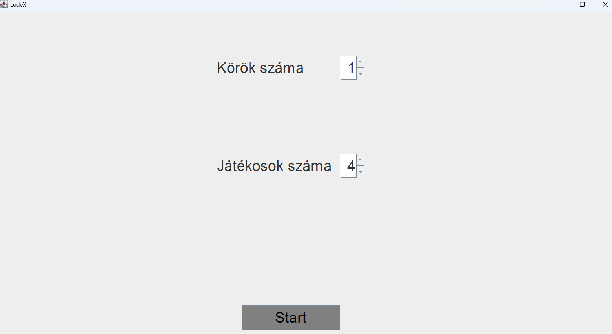
    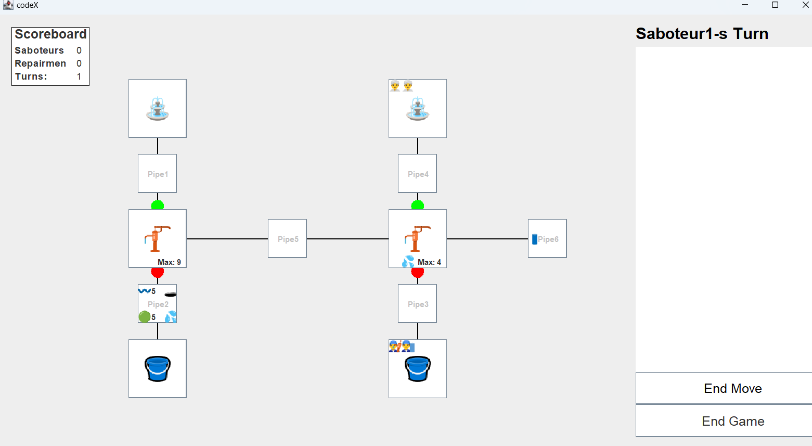

## Teszteset: Szerelők és szabotőrök mozgása

- **Cél**: Ellenőrizni, hogy a szerelők és szabotőrök megfelelően tudnak mozogni a csőhálózaton, beleértve a pumpákon az egymás mellet való elhaladást és a csöveken való mozgást.
- **Lépések**:
  1. A körök számát állitsa ötre a játékosok számát négyre majd nyomjon rá a startra.
  2. A "Saboteur1" nevű játékossal a "Pipe4"-re lépjen.
  3. A "Saboteur1" nevű játékossal az alatt lévő pumpára lépjen(Pump2).
  4. Nyomjon rá az "End Move" gombra.
  5. A "Saboteur2" nevű játékossal a "Pipe4"-re lépjen.
  6. A "Saboteur2" nevű játékossal az alatt lévő pumpára lépjen(Pump2).
  7. A "Saboteur2" nevű játékossal a "Pipe6" nevű mezőre lépjen.
  8. Nyomjon az "End Move" gombra.
  9. A "Repairman1" nevű szerelővel a "Pipe3" mezőre lépjen.
  10. A "Repairman1" nevű játékossal a felette lévő pumpára lépjen(Pump2).
  11. A "Repairman1" nevű játokssal a "Pipe6" lépjen a mezőre.
  12. A "Repairman2" nevű szerelővel a "Pipe3" mezőre lépjen.
  13. A "Repairman2" nevű játékossal a felette lévő pumpára lépjen(Pump2).
  14. A "Repairman2" nevű játokssal a "Pipe6" lépjen a mezőre.
- **Várható eredmény**: A pumpán egyszerre több játékos is tartózkodhat, míg a csöveken csak egyszerre egy. Emiatt minden lépésnek sikeres végre kellet hajtódjon az utolsót kivéve, mivel csak egy játékos tartózkodhat egy csövön.
- **Eredmény**: A teszt a várt eredményt hozta. Az utolsó lépés sikertelen az összes többi sikeres volt.
- **Képernyőképek**:

  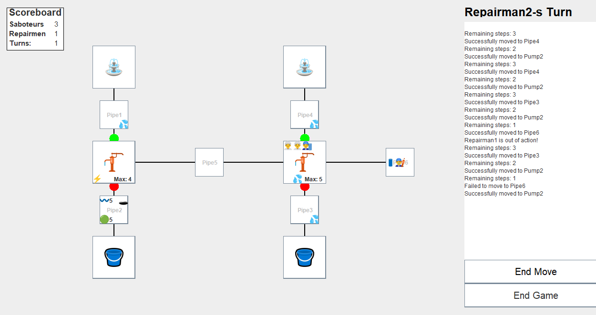
- **Megjegyzések**: -

## Teszteset: Ütközés tesztelése

- **Cél**: Ellenőrizni, hogy a több játékos nem tud egyszerre egy csövön állni.
- **Lépések**:
  1. Indítsa el a játékot.
  2. Mozgassa a Saboteur1-t a Pipe4-re.
  3. Nyomjon End move-ra.
  4. Mozgassa a Saboteur2-t a Pipe4-re

- **Várható eredmény**: 
  - Egy csövön egyszerre csak egy játékos lehet.
  - Ha egy játékos már a csövön van, a másik nem tud rálépni ugyanarra a csőre.

- **Eredmény**: 
  - A játékosok nem tudtak egyszerre ugyanazon a csövön állni
  
- **Megjegyzések**: 
  
- **Képernyőképek**:

   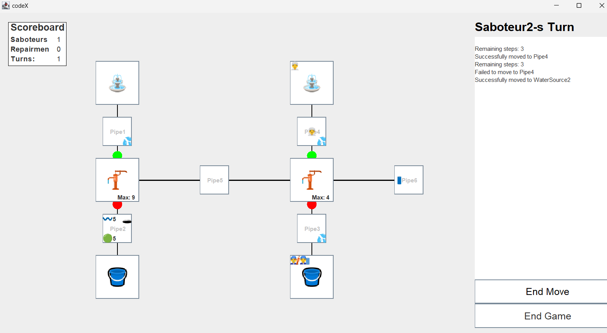

## Teszteset: Pumpa beállítása

- **Cél**: Ellenőrizni, hogy a játékosok megfelelően tudják beállítani a pumpákat, hogy a víz áramlása a kívánt irányban történjen.
- **Lépések**:
  1. A körök számát állitsa ötre a játékosok számát négyre majd nyomjon rá a startra.
  2. Egymás után kétszer nyomjon rá az "End Move" gombra.
  3. Kattinston a "Pipe3" nevű mezőre majd válassza a move opciót.
  4. Kattintson a "Pipe3" felett lévő mezőre majd válassza a move opciót.
  5. Kattinston a Pumpára amelyre lépett majd válassza az "Adjust Input to Pipe5" opciót.
  6. Nyomjon rá kétszer az "End Move" gombra.
- **Várható eredmény**: A szerelő a Pump2 mezőre áll, majd átállítja a víz forrásának irányát a Pipe5-re. Ezek után fentről nem folyhat át már víz a pumpán.
- **Eredmény**: A teszt a várt eredményt hozta. A víz folyási iránya megváltozott.
- **Képernyőképek**:

  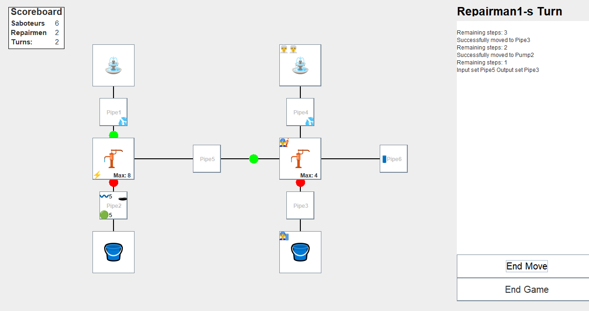
- **Megjegyzések**: -

## Teszteset: Pumpa elromlás tesztelése

- **Cél**: Ellenőrizni, hogy a pumpa meghibásodása esetén a vízáramlás megszűnik.
- **Lépések**:
  1. Indítsa el a játékot.
  2. Állítsa a körök számát minél többre
  3. Nyomjon End Move-t amég az egyik pumpa el nem romlik véletlen.

- **Várható eredmény**: 
  - A pumpa meghibásodása után a vízáramlás megszűnik az adott pumpánál.

- **Eredmény**: 
  - A pumpa meghibásodása után a vízáramlás megszűnt.
  
- **Megjegyzések**: 
    - Mivel a pumpák csak véletlen tudnak elromlani így csak minél több kör lejátszásával tesztelhető az elromlásuk.
  
- **Képernyőképek**:

   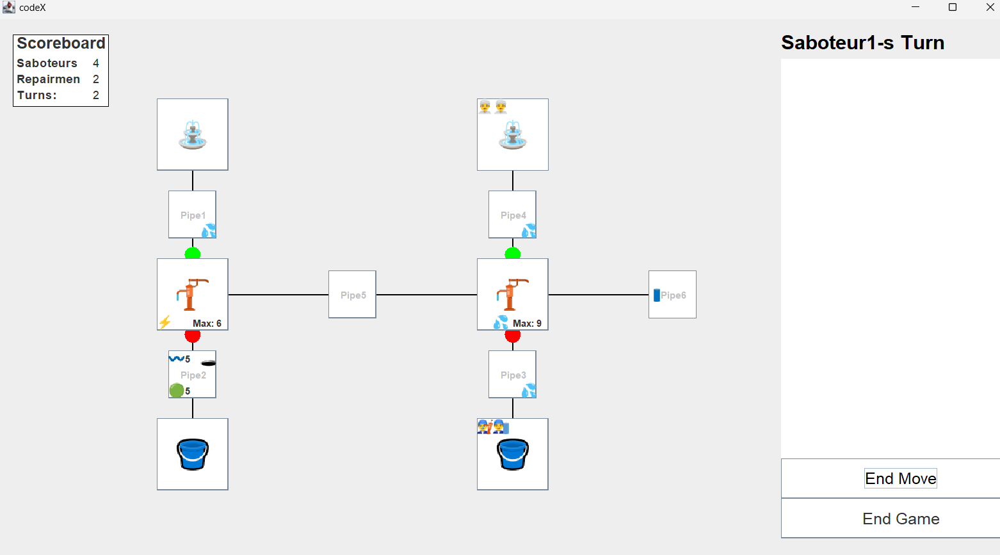

## Teszteset: Pumpa javítása

- **Cél**: Ellenőrizni, hogy a szerelők megfelelően tudják javítani a meghibásodott csöveket, és ezek a javítás után újra működnek.
- **Lépések**:
  1. A körök számát állitsa ötre a játékosok számát négyre majd nyomjon rá a startra.
  2. A "Saboteur1" nevű játékossal a Pipe4-re lépjen.
  3. A "Saboteur1" játékossal kattintson a Pipe4 mezőre majd válassza a "stab" opciót.
  4. A "Saboteur1" nevű játékossal lépjen vissza a forrásra.
  5. Egymás után kétszer nyomjon rá az "End Move" gombra.
  6. A "Repairman1" nevű szerelővel a "Pipe3" mezőre lépjen.
  7. A "Repairman1" nevű játékossal a felette lévő pumpára lépjen(Pump2).
  8. A "Repairman1" nevű szerelővel a "Pipe4" mezőre lépjen.
  9. Egymás után négyszer nyomjon rá az "End Move" gombra.
  10. Kattintson a "Pipe4" mezőre, majd válassza a "Repair" opciót.
  11. Nyomjon az "End Move" gombra
- **Várható eredmény**: A "Saboteur1" játékos a "Pipe4"-re lép majd kilyukasztja a csövet, majd visszalép a forrásra.A víz nem folyik tovább a csövön. A szerelő ezek után a "Pipe4" mezőre lép majd megjavítja azt. A víz folyás folytatódika csövön.
- **Eredmény**: A teszt a várt eredményt hozta. A víz folyási iránya megváltozott.
- **Képernyőképek**:

  A cső a kilyukasztás után:
  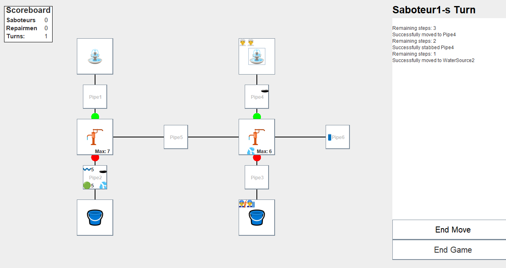
  A cső a megjavítás után:
  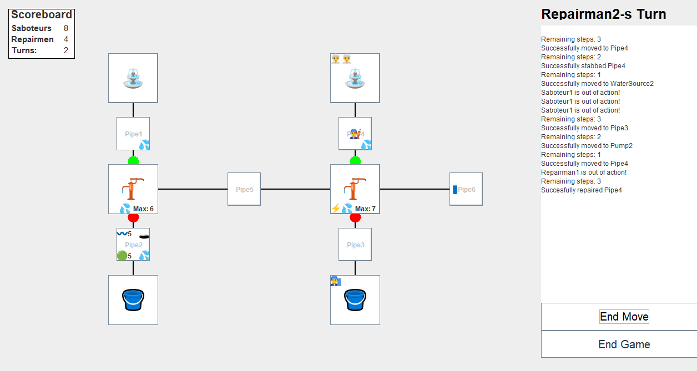
- **Megjegyzések**: -

## Teszteset: Új cső csatlakoztatása

- **Cél**: Ellenőrizni, hogy egy új cső csatlakoztatása a ciszternához megfelelően működik és a vízáramlás biztosított.
- **Lépések**:
  1. Indítsa el a játékot.
  2. Nyomjon 2x End Move-t
  3. Mozgassa az első szerelőt pump2-re
  4. Nyomjon End Move-t
  5. Válassza a placepipe opciót a cső lehelyezéséhez.
  6. Nyomjon 2x End Move-t
  7. Állítsa a Pump2 outputját pipe6-ra
  8. Figyelje meg a vízáramlást az új csőben.
- **Várható eredmény**: 
  - Az új cső megfelelően csatlakozik a ciszternához.
  - A víz megfelelően áramlik az új csőben.

- **Eredmény**: 
  - Az új cső sikeresen csatlakozott és a vízáramlás megfelelően működött.
  
- **Megjegyzések**: 
  - A program a lehelyezett csövet automatikusan egy üresen álló cső végéhez csatlakoztatja.
  
- **Képernyőképek**:

   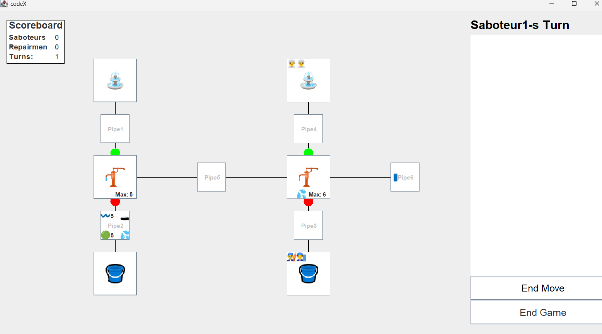
   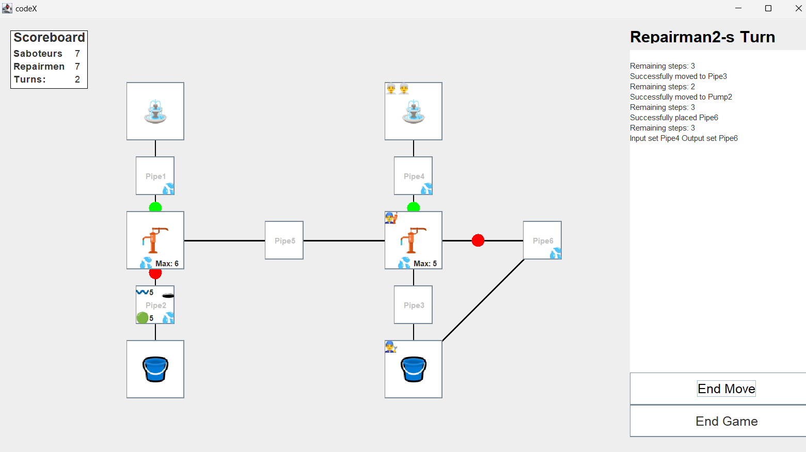

## Teszteset: Cső leválasztása és újra csatlakoztatása

- **Cél**: Ellenőrizni, hogy a szerelők megfelelően tudják leválasztani és újra csatlakoztatni a csöveket a rendszer átalakítása során.
- **Lépések**:
  1. A körök számát állitsa ötre a játékosok számát négyre majd nyomjon rá a startra.
  2. Egymás után háromszor nyomjon rá az "End Move" gombra.
  3. Kattintson a "Pipe3" alatti ciszternára.
  4. Válassza a PlacePipe ipciót.
  5. Kattintson ismét a ciszternára, majd válassza Pick Up Pipe6 opciót.
- **Várható eredmény**: A szerelő először lehelyezi egy csövet a ciszterna és a "Pipe 6" között. Ilyenkor megjelenik egy cső a két mező között. Ezek után a szerelő felveszi a lerakott csövet. A cső ezek után eltűnuk és a szerelő kezébe kerül.
- **Eredmény**: A teszt a várt eredményt hozta. A szerelő sikeresen tette le majd vett fel egy csövet.
- **Képernyőképek**:

  A cső lehelyezés után:
  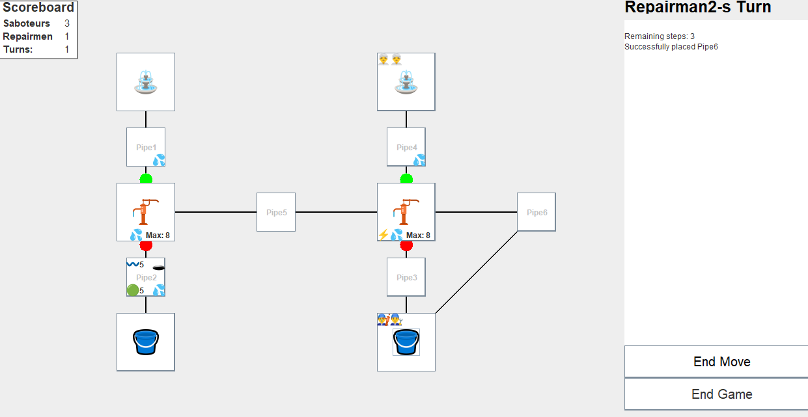
  A cső felvétele után:
  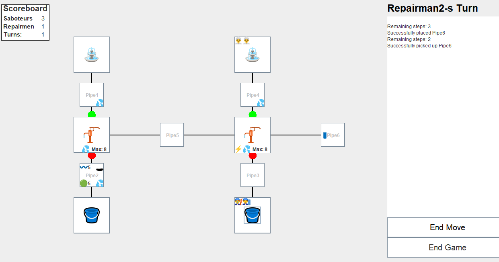
- **Megjegyzések**: -

## Teszteset: Lyukas cső ellenőrzése 

- **Cél**: Ellenőrizni, hogy a lyukas csőben nem folyik víz, javítása után a víz újra áramlik-e a csőben.
- **Lépések**:
  1. Indítsa el a játékot.
  
- **Várható eredmény**: 
  - A lyukas csövön nem tud átfolyni a víz, javítása után a víz újra áramlik a csőben.

- **Eredmény**: 
  - A lyukas csövön továbbra is áramlik a víz és eljut a ciszternákig, javítás után szintén áramlik tovább.
  
- **Megjegyzések**: -
  
- **Képernyőképek**:

   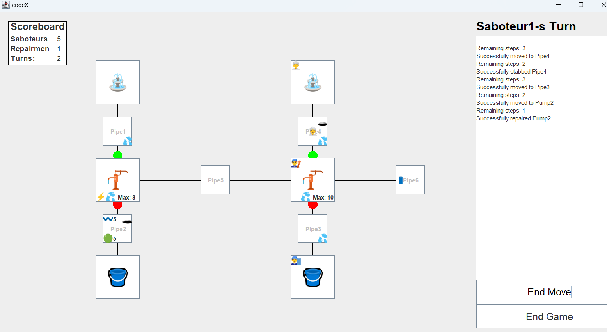
   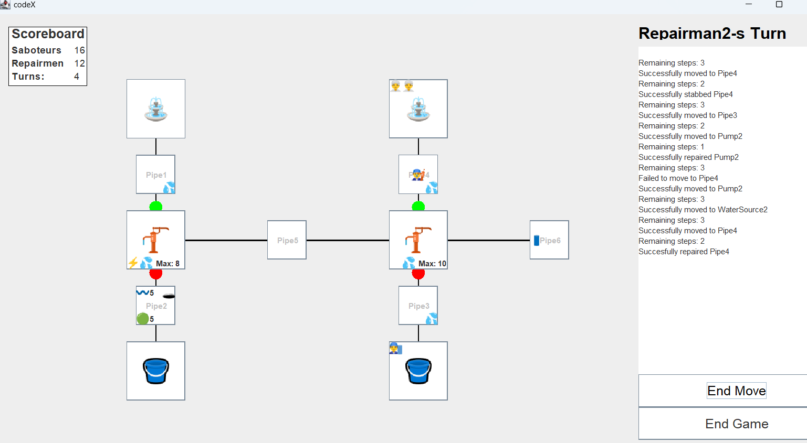

## Teszteset: Szabotőr tevékenysége

- **Cél**: Ellenőrizni, hogy a szabotőrök eltudják-e végezni szabotázs tevékenységeiket, mint például a pumpák átállítása és a csövek kilyukasztása.
- **Lépések**:
1. A körök számát állítsa ötre, a játékosok számát négyre, majd nyomjon rá a startra.
2. A "Saboteur1" nevű játékossal a "Pipe4"-re lépjen.
3. A "Saboteur1" játékossal kattintson a "Pipe4" mezőre, majd válassza a "Stab" opciót.
4. A "Saboteur1" nevű játékossal az alatt lévő pumpára lépjen (Pump2).
5. A "Saboteur1" játékossal kattintson a "Pump2" mezőre, majd válassza az "Adjust Input to Pipe6" opciót.
6. Nyomjon négyszer az "End Move" gombra.
- **Várható eredmény**: A "Saboteur1" játékos sikeresen kilyukasztja a "Pipe4" csövet, majd átállítja a "Pump2" bemeneti irányát a "Pipe6"-ra. A cső megsérül, és a pumpa vízforrásának iránya megváltozik.
- **Eredmény**: A teszt a várt eredményt hozta. A szabotőr sikeresen kilyukasztotta a csövet és átállította a pumpa bemeneti irányát.

- **Képernyőképek**:

  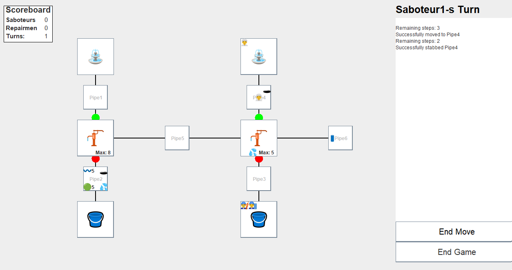
  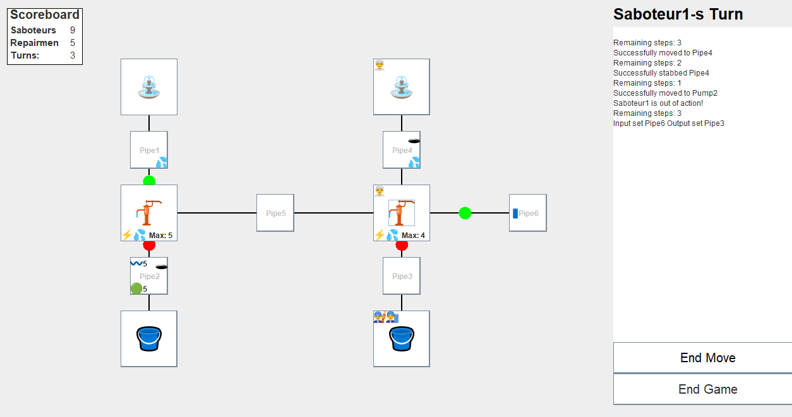
- **Megjegyzések**: -

## Teszteset: Szerelő tevékenység

- **Cél**: Ellenőrizni, hogy a szerelők el tudják-e végezni a javító tevékenységeket, például lyukas cső javítás pumpa állítás.
- **Lépések**:
  1. Indítsa el a játékot.
  2. Figyelje meg a pumpák működését a játék során.
  3. Nyomjon End Move-ot addig, hogy egy pumpa véletlenszerűen elromoljon.
  4. Látni, hogy az erlomlott pumpánál nem áramlik tovább a víz.
  5. Mozgassa a szerelőt a meghibásodott pumpához.
  6. Válassza a repair opciót.
  7. Ellenőrizze, hogy a vízáramlás helyreállt-e a javítás után.
- **Várható eredmény**: 
  - A szerelők sikeresen javítják a véletlenszerűen elromlott pumpákat, és a vízáramlás helyreáll.

- **Eredmény**: 
  - A szerelők sikeresen megjavították a meghibásodott pumpát, és a vízáramlás helyreállt.
  
- **Megjegyzések**: -
  
- **Képernyőképek**:

   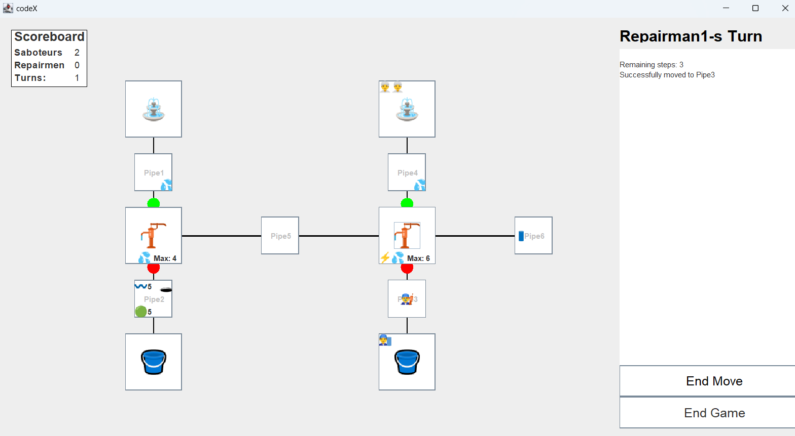
   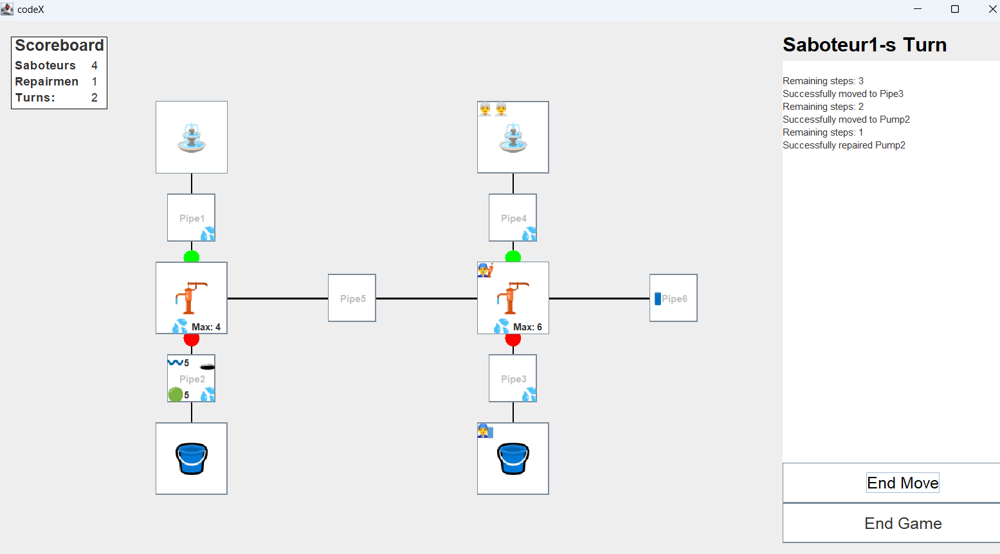

## Teszteset: Győzelmi feltételek ellenőrzése

- **Cél**:  Ellenőrizni, hogy a játék győzelmi feltételei megfelelően működnek, és a győztes csapat helyesen kerül meghatározásra.
- **Lépések**:
1. A körök számát állítsa háromra, a játékosok számát négyre, majd nyomjon rá a startra.
2. A "Saboteur1" nevű játékossal a "Pipe4"-re lépjen.
3. A "Saboteur1" játékossal kattintson a "Pipe4" mezőre, majd válassza a "Stab" opciót.majd válassza a "Stab" opciót.
4. Menjen rá kétszer az "End Move"-ra majd.
5. Várja meg a kör végét és figyelje meg, hogy melyik csapat nyeri a játékot.
- **Várható eredmény**: A játék a harmadik kör végén megfelelően értékeli ki a győzelmi feltételeket, és a győztes csapat helyesen kerül meghatározásra. Ha a szabotőrök sikeresen szabotálták a csöveket, és azok nincsenek megjavítva, ők nyernek.
- **Eredmény**: A teszt a várt eredményt hozta. A játék helyesen határozta meg a győztes csapatot.
- **Megjegyzések**: -

- **Képernyőképek**:

  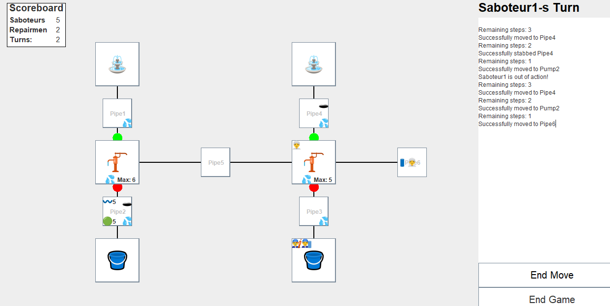
  

