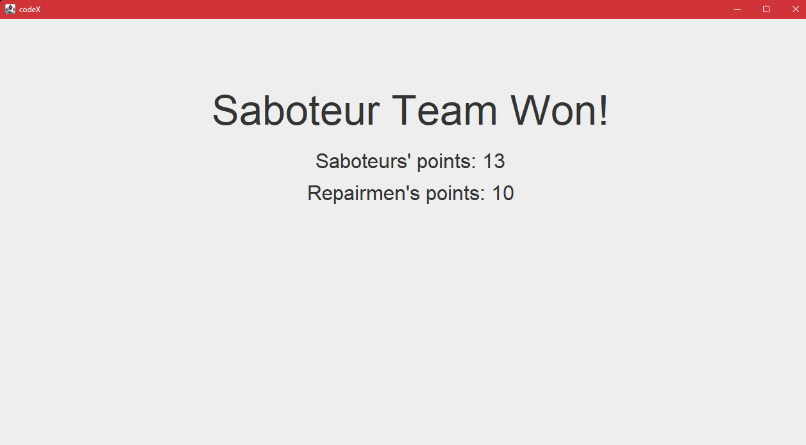

## Teszteset: Szerelők és szabotőrök mozgása

- **Cél**: Ellenőrizni, hogy a szerelők és szabotőrök megfelelően tudnak mozogni a csőhálózaton, beleértve a pumpákon az egymás mellet való elhaladást és a csöveken való mozgást.
- **Lépések**:
  1. A körök számát állitsa ötre a játékosok számát négyre majd nyomjon rá a startra.
  2. A "Saboteur1" nevű játékossal a "Pipe4"-re lépjen.
  3. A "Saboteur1" nevű játékossal az alatt lévő pumpára lépjen(Pump2).
  4. Nyomjon rá az "End Move" gombra.
  5. A "Saboteur2" nevű játékossal a "Pipe4"-re lépjen.
  6. A "Saboteur2" nevű játékossal az alatt lévő pumpára lépjen(Pump2).
  7. A "Saboteur2" nevű játékossal a "Pipe6" nevű mezőre lépjen.
  8. Nyomjon az "End Move" gombra.
  9. A "Repairman1" nevű szerelővel a "Pipe3" mezőre lépjen.
  10. A "Repairman1" nevű játékossal a felette lévő pumpára lépjen(Pump2).
  11. A "Repairman1" nevű játokssal a "Pipe6" lépjen a mezőre.
  12. A "Repairman2" nevű szerelővel a "Pipe3" mezőre lépjen.
  13. A "Repairman2" nevű játékossal a felette lévő pumpára lépjen(Pump2).
  14. A "Repairman2" nevű játokssal a "Pipe6" lépjen a mezőre.
- **Várható eredmény**: A pumpán egyszerre több játékos is tartózkodhat, míg a csöveken csak egyszerre egy. Emiatt minden lépésnek sikeres végre kellet hajtódjon az utolsót kivéve, mivel csak egy játékos tartózkodhat egy csövön.
- **Eredmény**: A teszt a várt eredményt hozta. Az utolsó lépés sikertelen az összes többi sikeres volt.

- **Megjegyzések**: -

## Teszteset: Pumpa beállítása

- **Cél**: Ellenőrizni, hogy a játékosok megfelelően tudják beállítani a pumpákat, hogy a víz áramlása a kívánt irányban történjen.
- **Lépések**:
  1. A körök számát állitsa ötre a játékosok számát négyre majd nyomjon rá a startra.
  2. Egymás után kétszer nyomjon rá az "End Move" gombra.
  3. Kattinston a "Pipe3" nevű mezőre majd válassza a move opciót.
  4. Kattintson a "Pipe3" felett lévő mezőre majd válassza a move opciót.
  5. Kattinston a Pumpára amelyre lépett majd válassza az "Adjust Input to Pipe5" opciót.
  6. Nyomjon rá kétszer az "End Move" gombra.
- **Várható eredmény**: A szerelő a Pump2 mezőre áll, majd átállítja a víz forrásának irányát a Pipe5-re. Ezek után fentről nem folyhat át már víz a pumpán.
- **Eredmény**: A teszt a várt eredményt hozta. A víz folyási iránya megváltozott.

- **Megjegyzések**: -

## Teszteset: Pumpa javítása

- **Cél**: Ellenőrizni, hogy a szerelők megfelelően tudják javítani a meghibásodott csöveket, és ezek a javítás után újra működnek.
- **Lépések**:
  1. A körök számát állitsa ötre a játékosok számát négyre majd nyomjon rá a startra.
  2. A "Saboteur1" nevű játékossal a Pipe4-re lépjen.
  3. A "Saboteur1" játékossal kattintson a Pipe4 mezőre majd válassza a "stab" opciót.
  4. A "Saboteur1" nevű játékossal lépjen vissza a forrásra.
  5. Egymás után kétszer nyomjon rá az "End Move" gombra.
  6. A "Repairman1" nevű szerelővel a "Pipe3" mezőre lépjen.
  7. A "Repairman1" nevű játékossal a felette lévő pumpára lépjen(Pump2).
  8. A "Repairman1" nevű szerelővel a "Pipe4" mezőre lépjen.
  9. Egymás után négyszer nyomjon rá az "End Move" gombra.
  10. Kattintson a "Pipe4" mezőre, majd válassza a "Repair" opciót.
  11. Nyomjon az "End Move" gombra
- **Várható eredmény**: A "Saboteur1" játékos a "Pipe4"-re lép majd kilyukasztja a csövet, majd visszalép a forrásra.A víz nem folyik tovább a csövön. A szerelő ezek után a "Pipe4" mezőre lép majd megjavítja azt. A víz folyás folytatódika csövön.
- **Eredmény**: A teszt a várt eredményt hozta. A víz folyási iránya megváltozott.
A cső a kilyukasztás után:

A cső a megjavítás után:

- **Megjegyzések**: -

## Teszteset: Cső leválasztása és újra csatlakoztatása

- **Cél**: Ellenőrizni, hogy a szerelők megfelelően tudják leválasztani és újra csatlakoztatni a csöveket a rendszer átalakítása során.
- **Lépések**:
  1. A körök számát állitsa ötre a játékosok számát négyre majd nyomjon rá a startra.
  2. Egymás után háromszor nyomjon rá az "End Move" gombra.
  3. Kattintson a "Pipe3" alatti ciszternára.
  4. Válassza a PlacePipe ipciót.
  5. Kattintson ismét a ciszternára, majd válassza Pick Up Pipe6 opciót.
- **Várható eredmény**: A szerelő először lehelyezi egy csövet a ciszterna és a "Pipe 6" között. Ilyenkor megjelenik egy cső a két mező között. Ezek után a szerelő felveszi a lerakott csövet. A cső ezek után eltűnuk és a szerelő kezébe kerül.
- **Eredmény**: A teszt a várt eredményt hozta. A szerelő sikeresen tette le majd vett fel egy csövet.
A cső lehelyezés után:

A cső felvétele után:

- **Megjegyzések**: -

## Teszteset: Szabotőr tevékenysége

- **Cél**: Ellenőrizni, hogy a szabotőrök eltudják-e végezni szabotázs tevékenységeiket, mint például a pumpák átállítása és a csövek kilyukasztása.
- **Lépések**:
1. A körök számát állítsa ötre, a játékosok számát négyre, majd nyomjon rá a startra.
2. A "Saboteur1" nevű játékossal a "Pipe4"-re lépjen.
3. A "Saboteur1" játékossal kattintson a "Pipe4" mezőre, majd válassza a "Stab" opciót.
4. A "Saboteur1" nevű játékossal az alatt lévő pumpára lépjen (Pump2).
5. A "Saboteur1" játékossal kattintson a "Pump2" mezőre, majd válassza az "Adjust Input to Pipe6" opciót.
6. Nyomjon négyszer az "End Move" gombra.
- **Várható eredmény**: A "Saboteur1" játékos sikeresen kilyukasztja a "Pipe4" csövet, majd átállítja a "Pump2" bemeneti irányát a "Pipe6"-ra. A cső megsérül, és a pumpa vízforrásának iránya megváltozik.
- **Eredmény**: A teszt a várt eredményt hozta. A szabotőr sikeresen kilyukasztotta a csövet és átállította a pumpa bemeneti irányát.

- **Megjegyzések**: -

## Teszteset: Győzelmi feltételek ellenőrzése

- **Cél**:  Ellenőrizni, hogy a játék győzelmi feltételei megfelelően működnek, és a győztes csapat helyesen kerül meghatározásra.
- **Lépések**:
1. A körök számát állítsa háromra, a játékosok számát négyre, majd nyomjon rá a startra.
2. A "Saboteur1" nevű játékossal a "Pipe4"-re lépjen.
3. A "Saboteur1" játékossal kattintson a "Pipe4" mezőre, majd válassza a "Stab" opciót.majd válassza a "Stab" opciót.
4. Menjen rá kétszer az "End Move"-ra majd.
5. Várja meg a kör végét és figyelje meg, hogy melyik csapat nyeri a játékot.
- **Várható eredmény**: A játék a harmadik kör végén megfelelően értékeli ki a győzelmi feltételeket, és a győztes csapat helyesen kerül meghatározásra. Ha a szabotőrök sikeresen szabotálták a csöveket, és azok nincsenek megjavítva, ők nyernek.
- **Eredmény**: A teszt a várt eredményt hozta. A játék helyesen határozta meg a győztes csapatot.
- **Megjegyzések**: -

